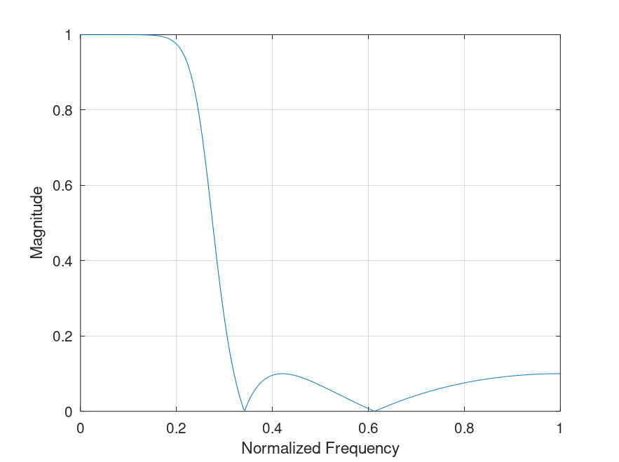
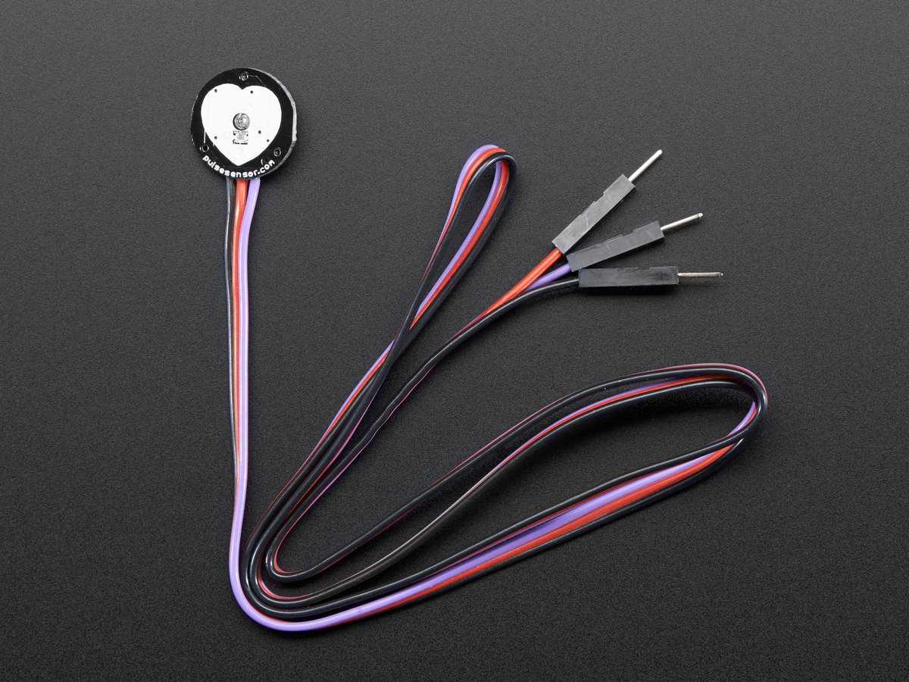

# Filtragem e análise de sinal PPG para microcontroladores STM32F4

## Filtro digital IIR

Está sendo usado um filtro de topologia chebyshev tipo II de quarta ordem. Sendo essa topologia a que tem melhor performance para filtragem de sinais PPG de curta duração. Os parametros de sintonização do filtro são:

 - Wcorte: 4hz
 - Wamostragem: 25hz
 - Atenuação de banda de rejeição: -20db

 Para o filtro projetado temos a seguinte resposta em frequencia:

 

 ## Sensor de sinal PPG 
Foi usado nesse projeto o sensor de baixo custo Amped

